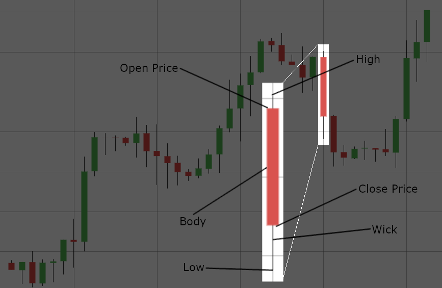
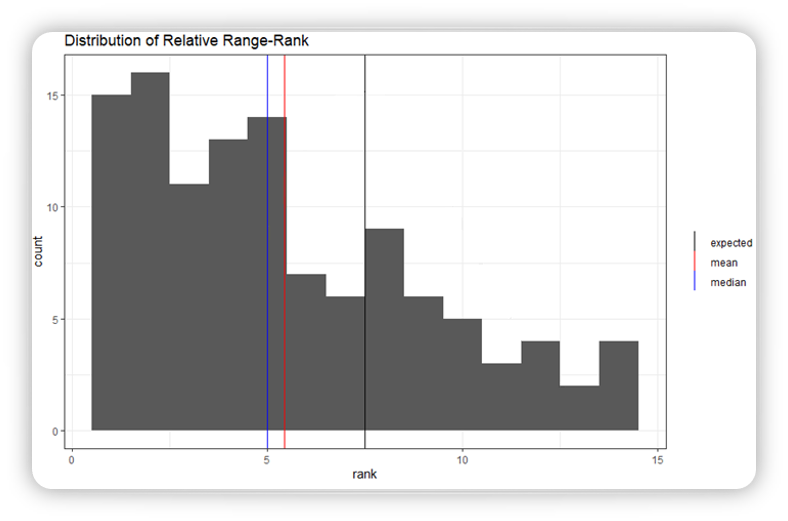

```{r setup, include=FALSE}
knitr::opts_chunk$set(echo = FALSE)
```

## Background

For this project, I wanted to us NLP (Natural Language Processing) to determine what effects the News had on the Forex Market.

#### What is Forex?

Forex is short for Foreign Exchange. The Forex market is the trading of currencies around the world. As the currencies change in power one to another people can trade their currencies for profit. Forex uses what is called pairs. A pair is the comparison of two currencies. All the following analysis was using the pair United States Dollar / Canadian Dollar (USDCAD).

#### What are Candles?


Candles are a measure of time. Each candle represents a time period. It can be 30 Minutes, 3 Hours, 1 Day, 1 Year, etc... If the candle is red the open and close prices are as shown (at the top and bottom of the body respectively). If the candle is green that means the open and close prices are flipped from what is shown (Open on the bottom of the body and Close at the top).

#### What is an ATR?

An ATR (Average True Range) is a measurement of the movement of the market. It doesn't represent direction, just the amount that the market is moving. It is similar to the variance of the market. A range is calculated by taking the High and subtracting the low from it. The ATR is the mean of these ranges of a certain number of candles. In this analysis a 14 candle ATR was used.

## Steps

### Gather Data

##### News

For this project I decided to use the Federal Reserve Statements as my news sources. An example of one of these can be found [here](https://www.federalreserve.gov/newsevents/pressreleases/monetary20070321a.htm).

These statments were directly downloaded from the [Federal Reserve Website](https://www.federalreserve.gov/). The dates and times were determined from [Forex Factory](https://www.forexfactory.com/). 

##### Candles

The candles that were used in this project were downloaded from [Oanda](https://www.oanda.com/us-en/) using a proprietary downloader from the company Liberty Dynamic Consultants that I was able to use for this project.

### Build Data

##### Prepare news for NLP

In order to prepare the Federal Reserve Statements for NLP I had strip it from the downloaded HTMLs and then pre-process it. A computer can't really read or understand language. The best that it can do is make correlations between words and a classification. A major problem is that *Hello* and *hello* are not seen as the same thing to a computer due to the capital *h*. capitals and many other things can make a computer need considerably more data. Here are some of the stepsI followed to pre-process the raw text.

1. Find a way to grab just the wanted text from the HTMLs.
2. Add spaces to split words that got combined in the stripping process.
3. Remove punctuation.
4. Remove unwanted white space. (Sometimes there were double spaces in the middle of the text and extra spaces at the beginning and end. These needed to be removed because 'hello' and ' hello' are not considered the same thing to a computer.)
5. Make all words be lower case.
6. Change all numbers to a uniform "num" word. (This was done because the numbers taken out of context are meaningless. If we want to keep the numbers, they should be seen as a separate entity and labeled as what the number means rather than being labeled as a word.)
7. Remove Stopwords. (Some words have little to no meaning such as *a* and *the*. These words are called stopwords and should be removed as to not clutter the data and cause the need for more data to be higher.)
8. Lemmatize or Stem the words. This causes words that have the same root word to be considered as the same word. Stemming does this as an algorithm, therefore it doesn't do quite as good, but it is quite fast. Problems that may arise is that words like *mean* and *meaning* end up both as *mean* when stemming and *goose* and *geese* are still seen as completely different words. Lemmatizing on the other hand is slower, but it will look up what the root word for each word and turn all the words into their dictionary base word. This means that *goose* and *geese* are both seen as *goose*. Lemmatizing is slower than Stemming. These considerations should be used when making the decision on which to use.

##### Calculate ATR

In order to calculate this take the high of a candle and subtract the low. Add this number to all the other high-low and divide by the number of candles. Example of doing this in R: `candles_with_atr_30_min <- candles_filtered %>%`
  `arrange(date) %>%`
  `mutate(row_num = row_number()) %>%`
  `rowwise() %>% `
  `mutate(atr = atr_calc(candles_filtered[(abs(row_num-14)):abs(row_num-1),3],`
  `candles_filtered[abs(row_num-14):abs(row_num-1),4]))`
  
`atr_calc <- function(high.df, low.df){ return(sum(high.df - low.df) / nrow(high.df)) }`

### ATR Discovery

As I was analyzing the ATR and the candles I discovered that the range of the news candle was often lower than the ATR, which surprised me. I dug a little deeper to see how much lower they were, and if it was possibly an insignificant amount. To do this, I took the ranges of the 14 ATR candles and ordered them least to greatest. Then I placed the News Candle in the order where it should be and gave it a rank according to its placement (1-15, 1 being the smallest candle and 15 being the largest). If the news had no affect on the movement of the market we would have expected the news candle's ranking to be evenly spread between 1 and 15 (1 would have been just as likely as 15). This is not what I found. The news candles are very clustered to the left side, many being the smallest or second smallest candles as shown in the graph below. This means that the market takes a relative pause for up to three hours after a news event.



### NLP Discovery

As I was preparing the text for NLP I discovered that I had too many words and not enough statements. In order for a machine learning project ot be effective, the number of columns needs to be smaller than the number of rows. The problem is that the number of columns that I had was 8 to 10 times larger than the number of rows. This made it so that I was unable to pursue an NLP model with just the Federal Reserve Statments that are released 8 times a year.


## Where to go

1. In Order the actually do NLP, I will need to obtain more news data dn not rely and a single type. This could cause other complications, but it is necessary.
2. There are techniques (such as getting rid of words only ever used once) to limit the amount of words that are being considered within the NLP which might allow for a model to be built with fewer rows.
3. Investigation into why the market stops moving (is it because the news is opposite the current trend of the market? What other reasons could be the cause?)
4. Because the market doesn't move in the time frame that I looked at, money cannot be made. In order to make money the market must be moving. Discover what happens once the market starts moving as well as when it starts moving again.


